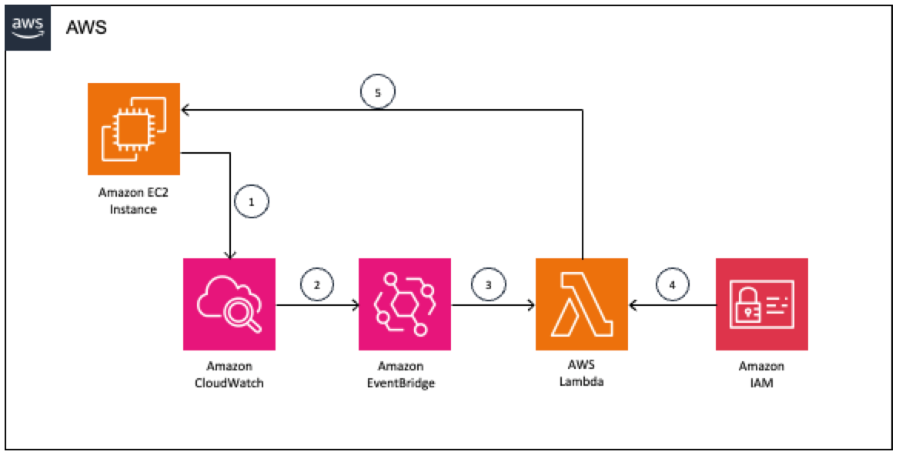

## Hibernating EC2 Instances in Response to a CloudWatch Alarm
This project demonstrates how to use AWS Cloud Development Kit (CDK) for the [Hibernating EC2 Instances in Response to a CloudWatch Alarm](https://aws.amazon.com/blogs/compute/hibernating-ec2-instances-in-response-to-a-cloudwatch-alarm/) blog post which explores a solution that will find idle instances using an Amazon CloudWatch alarm that monitors the instance’s CPU usage. When the CPU usage consistently drops below the alarm’s threshold, the alarm enters the ALARM state and raises an event used to identify the instance and trigger hibernation.

#### The following architecture diagram shows a solution.


<p align="center"><i> Figure 1 – Solution architecture </i></p>

* An EC2 instance sends metrics to CloudWatch.
* A CloudWatch alarm detects an idle instance and sends the event to EventBridge.
* EventBridge triggers a Lambda function.
* The Lambda function evaluates the execution role permissions.
* The Lambda function identifies the instance and sends the hibernation signal.

### To implement the solution, follow these steps:

* Create an EC2 Instance 
* Create an IAM role with necessary permissions
* Create a Lambda function
* Create a CloudWatch Alarm 
* Configure the EC2 instance to send metrics to CloudWatch
* Create an EventBridge Rule

---

The `cdk.json` file tells the CDK Toolkit how to execute your app.

This project is set up like a standard Python project.  The initialization process also creates
a virtualenv within this project, stored under the .venv directory.  To create the virtualenv
it assumes that there is a `python3` executable in your path with access to the `venv` package.
If for any reason the automatic creation of the virtualenv fails, you can create the virtualenv
manually once the init process completes.

To manually create a virtualenv on MacOS and Linux:

```
$ python3 -m venv .venv
```

After the init process completes and the virtualenv is created, you can use the following
step to activate your virtualenv.

```
$ source .venv/bin/activate
```

If you are a Windows platform, you would activate the virtualenv like this:

```
% .venv\Scripts\activate.bat
```

Once the virtualenv is activated, you can install the required dependencies.

```
$ pip install -r requirements.txt
```

At this point you can now synthesize the CloudFormation template for this code.

```
$ cdk synth
```

You can now begin exploring the source code, contained in the hello directory.
There is also a very trivial test included that can be run like this:

```
$ pytest
```

To add additional dependencies, for example other CDK libraries, just add to
your requirements.txt file and rerun the `pip install -r requirements.txt`
command.

## Useful commands

 * `cdk ls`          list all stacks in the app
 * `cdk synth`       emits the synthesized CloudFormation template
 * `cdk deploy`      deploy this stack to your default AWS account/region
 * `cdk diff`        compare deployed stack with current state
 * `cdk docs`        open CDK documentation

Enjoy!
