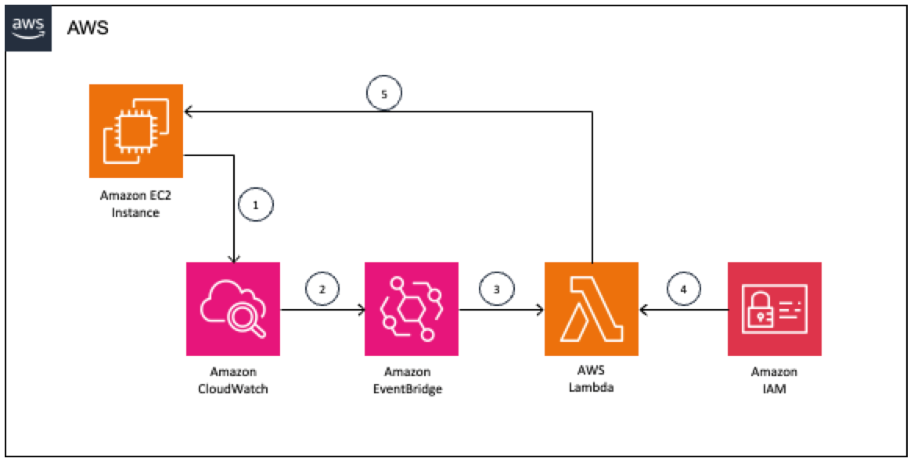

## Hibernating EC2 Instances in Response to a CloudWatch Alarm
This project demonstrates how to use AWS Cloud Development Kit (CDK) for the [Hibernating EC2 Instances in Response to a CloudWatch Alarm](https://aws.amazon.com/blogs/compute/hibernating-ec2-instances-in-response-to-a-cloudwatch-alarm/) blog post which explores a solution that will find idle instances using an Amazon CloudWatch alarm that monitors the instance’s CPU usage. When the CPU usage consistently drops below the alarm’s threshold, the alarm enters the ALARM state and raises an event used to identify the instance and trigger hibernation.

#### The following architecture diagram shows a solution.

<i> Figure 1 – Solution architecture </i>

* An EC2 instance sends metrics to CloudWatch.
* A CloudWatch alarm detects an idle instance and sends the event to EventBridge.
* EventBridge triggers a Lambda function.
* The Lambda function evaluates the execution role permissions.
* The Lambda function identifies the instance and sends the hibernation signal.

### To implement the solution, follow these steps:

* Create an EC2 Instance 
* Create an IAM role with necessary permissions
* Create a Lambda function
* Create a CloudWatch Alarm 
* Configure the EC2 instance to send metrics to CloudWatch
* Create an EventBridge Rule

---

The `cdk.json` file tells the CDK Toolkit how to execute your app.

## Useful commands

* `npm run build`   compile typescript to js
* `npm run watch`   watch for changes and compile
* `npm run test`    perform the jest unit tests
* `npx cdk deploy`  deploy this stack to your default AWS account/region
* `npx cdk diff`    compare deployed stack with current state
* `npx cdk synth`   emits the synthesized CloudFormation template
